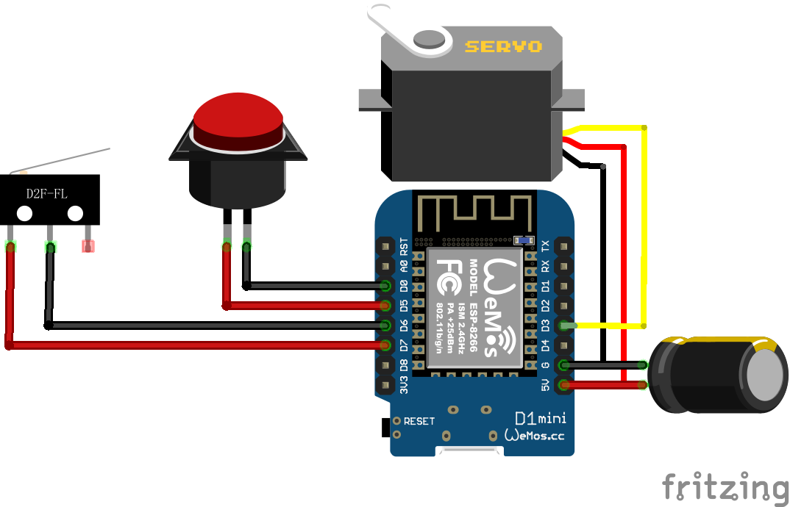

# smart-lights

This is a non-intrusive light switch automation controller based on the design of [suyashkumar/smart-lights](https://github.com/suyashkumar/smart-lights). The goal is to accommodate a regular lever-type light switch into Home Assistant without replacing the original switch. ESPHome is used.

# Wiring and installation

A Wemos D1 mini is used as the controller. In my case, the servo needs to be at least MG995 to have enough strength to toggle the switch (SG90 didn't work as it's too weak). The capacitor across 5V power is mandatory (the larger the better, for which I used 470uF), otherwise there is a risk of frying the onboard 3.3V LDO. You can use anything that's momentary and normally open for the manual button and end-stop switch, but you may need to modify the 3D model of the installation panel to fit your part. Use a power supply with enough current (I used a phone charger of 5V 3A, plugging into the micro USB of the D1 mini) for the servo to work.

After checking the wiring, use ESPHome utility to compile and write the code to your D1 mini. You can now test with the manual button to see if the servo is working. Install the servo onto the panel and fix the panel onto your switch. Adjust the `level` of `servo.write` inside `turn_on_action` and `turn_off_action` so that the servo could swing wide enough to toggle the switch fully, but without stalling. You may need to test this multiple times.

# TODO

- [x] Refine and upload ESPHome config YAML

- [x] Add an endstop switch or similar to provide some sort of feedback
